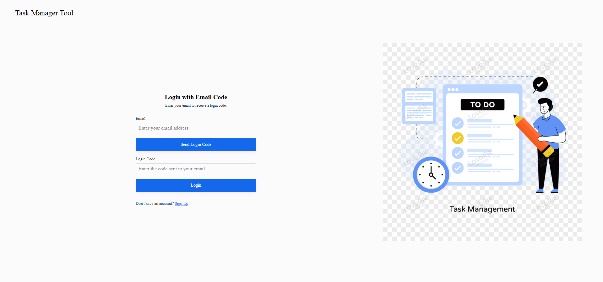
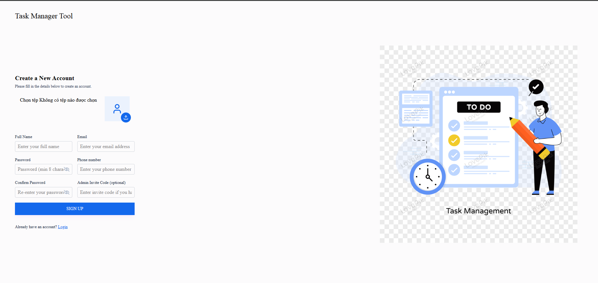
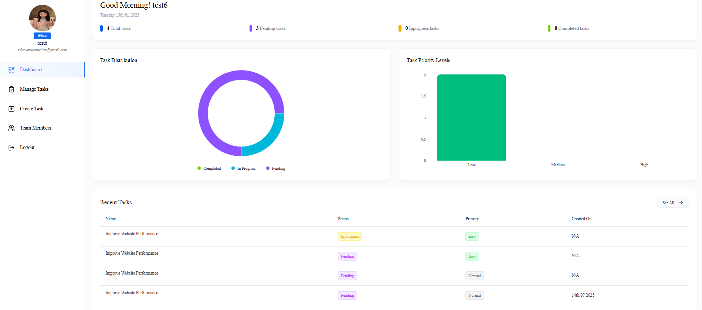
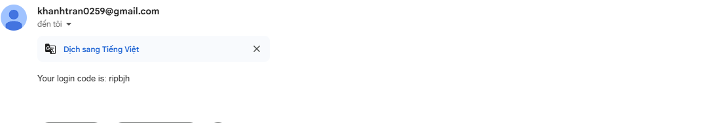
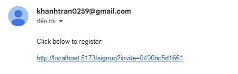
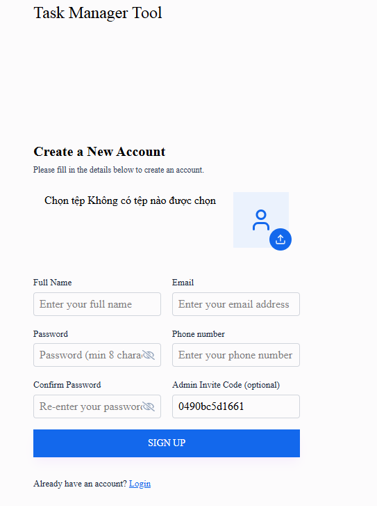

A modern task management app built with Node.js (Express) + Firebase Realtime Database for the backend and React (Vite) for the frontend.
📂 Project structure
project
├── backend                # Node.js + Express + Firebase
│   ├── config             # Firebase & DB configuration
│   ├── controllers        # Route controllers
│   ├── middlewares        # Custom middlewares
│   ├── models             # Data models
│   ├── routes             # API routes
│   ├── utils              # Utility functions (email, SMS, helpers)
│   ├── uploads            # Uploaded files (profile images etc.)
│   ├── .env.example       # Example environment config
│   ├── .gitignore
│   └── server.js
├── frontend               # React (Vite)
│   ├── public
│   ├── src
│   │   ├── assets
│   │   ├── components
│   │   ├── contexts
│   │   ├── hooks
│   │   ├── pages
│   │   ├── routes
│   │   └── utils
│   ├── .gitignore
│   ├── index.html
│   └── vite.config.js
└── README.md

🚀 Features
* Login & signup with invite codes or email code verification

* Admin dashboard to manage users & tasks

* CRUD operations for tasks

* Email notifications (using Nodemailer)

* SMS notifications (using Twilio)

* Firebase Realtime Database for data storage

⚙️ How to Run
- Backend
cd backend
npm install
cp .env.example .env   # Create your own .env file with real values
npm start

The server will run on: http://localhost:8080

-Frontend
cd frontend
npm install
npm run dev
The app will run on: http://localhost:5173
🔑 Environment Variables
** backend/.env.example
PORT=8080

# Email (Nodemailer)
MAIL_USER=your-email@gmail.com
MAIL_PASS=your-email-password

# Twilio
TWILIO_ACCOUNT_SID=your_twilio_sid
TWILIO_AUTH_TOKEN=your_twilio_auth_token
TWILIO_PHONE_NUMBER=+1xxxxxxxxxx

# Firebase
FIREBASE_PROJECT_ID=your_project_id
FIREBASE_CLIENT_EMAIL=your_client_email
FIREBASE_PRIVATE_KEY="your_private_key_with_escaped_newlines"

🛠️ Tech Stack
Backend: Node.js, Express.js, Firebase Realtime Database

Frontend: React, Vite, Tailwind CSS

Others: Nodemailer, Twilio

## 📸 Screenshot

